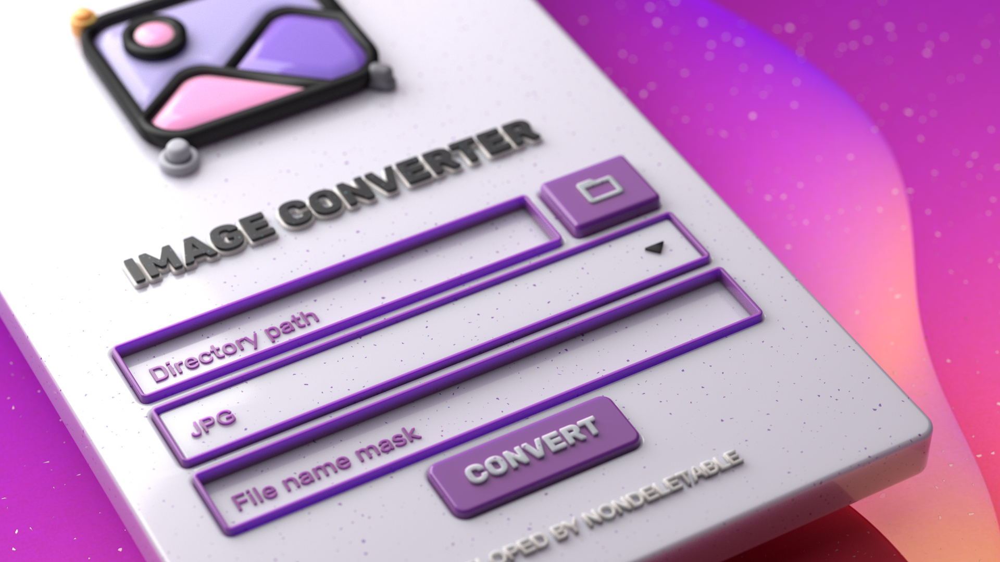

  
<h2>Image Converter</h2>

Eine übersichtliche Desktop-App zum massenhaften Umbenennen und Konvertieren von Bildern - schnell, sichere Dateinamen und vorhersehbare Ergebnisse.

  

    
    
    
  

  

    <a href="https://github.com/nondeletable/Image-Converter/tree/main/README/README-IC-EN.md">English </a> |  
    <a href="https://github.com/nondeletable/Image-Converter/tree/main/README/README-IC-DE.md">Deutsch </a> |
    <a href="https://github.com/nondeletable/Image-Converter/tree/main/README/README-IC-CN.md">简体中文 </a> | 
    <a href="https://github.com/nondeletable/Image-Converter/tree/main/README/README-IC-VN.md">Tiếng Việt </a> | 
    <a href="https://github.com/nondeletable/Image-Converter/tree/main/README/README-IC-RU.md">Русский </a>
     
     
    
     
     
  

## 🖼️ Was diese App macht

Image Converter begann als kleines Hilfstool für ein sehr reales Problem: Referenzordner.  
Die App hilft Künstler:innen dabei, ihre Bild-Referenzsammlungen sauber zu halten und spart Zeit beim manuellen Umbenennen.

Wenn du viele Referenzen von Pinterest (vor allem), ArtStation, Behance oder Google Images sammelst, kennst du das Problem: chaotische Dateinamen, merkwürdige Endungen und ein einfaches „Umbenennen in .jpg“ macht die Datei oft nicht wirklich nutzbar.

Diese App kombiniert deshalb zwei Dinge in einem klaren Workflow:  
**Batch-Umbenennung** (mit einem vorhersehbaren Namensschema) und **echte Konvertierung**, sodass Dateien zuverlässig geöffnet werden können.
&nbsp;
&nbsp;

## 🎨 Funktionen

- Massenhaftes Umbenennen unsauberer Bilddateien in ein klares Schema wie `ref_001.jpg`, `ref_002.jpg` …
- Konvertierung in ein sauberes Format (JPG/JPEG, PNG), damit Dateien zuverlässig funktionieren.
- Automatische Behandlung von Duplikaten durch `_copy`, `_copy2` …
- Bereinigung von Dateinamen (entfernt ungültige Zeichen).
- Fortschrittsanzeige, Überspringen defekter Dateien und ein einfacher Workflow.
- Sauberes, minimalistisches Interface.
&nbsp;
&nbsp;

## 😎 Datenschutz & Sicherheit

- ✅ Läuft vollständig lokal auf deinem Rechner.
- ✅ Keine Accounts, kein Tracking, keine Telemetrie.
- ✅ Deine Dateien verlassen niemals deinen PC.
&nbsp;
&nbsp;

## ⚒ Installation

- Gehe zu **Releases** und lade die neueste „.exe“ herunter.
- Entpacke sie an einen beliebigen Ort (Desktop, Tools-Ordner, USB-Stick).
- Starte „Image Converter.exe“.
&nbsp;
&nbsp;

## 🏓 Verwendung

1. Eingabeordner auswählen.
2. Ausgabeformat wählen.
3. Dateinamen-Maske festlegen (z. B. `ref_###` → `ref_001`, `ref_002` …).
4. **Start** klicken und warten, bis der Vorgang abgeschlossen ist.

  

&nbsp;
&nbsp;

## 💾 Technologien

- Python 3.13
- Flet (UI)
- Pillow (Konvertierung)
- pytest + coverage (Tests)
- ruff, black, pre-commit (Code-Qualität)
- PyInstaller (Windows-Builds)
&nbsp;
&nbsp;

## ✅ Qualität

- Testabdeckung: **87 %**
- Releases: **3** (Gesamtversionen: **5**)
- Windows-Buildgröße: ca. **83 MB**
&nbsp;
&nbsp;

## 📄 Lizenz

Dieses Projekt steht unter der MIT-Lizenz - Einzelheiten finden Sie in der Datei [LICENSE](https://github.com/nondeletable/Image-Converter/blob/main/LICENSE).

© 2025-2026 nondeletable
&nbsp;
&nbsp;

## ☎ Support & Kontakte

Wenn du an einer Zusammenarbeit interessiert bist oder über Jobmöglichkeiten sprechen möchtest, nutze gern einen der folgenden Kontakte.  
Für Support oder Bug-Reports bitte Discord oder GitHub Issues verwenden. Ich antworte in der Regel innerhalb von 24 Stunden.

- 🐙 **GitHub** - Docs, Releases, Quellcode  
  https://github.com/nondeletable
- 💬 **Discord** - News, Support, Fragen und Bug-Reports  
  https://discord.com/invite/6nvXwXp78u
- ✈️ **Telegram** - Direktnachrichten  
  https://t.me/nondeletable
- 📧 **E-Mail** - formelle oder geschäftliche Anfragen  
  nondeletable@gmail.com
- 💼 **LinkedIn** - berufliches Profil  
  https://www.linkedin.com/in/aleksandra-gicheva-3b0264341/
- ☕ **Boosty** - Unterstützung meiner Arbeit und Projekte durch Spenden  
  https://boosty.to/codebird/donate  
&nbsp;
&nbsp;

**Vielen Dank für die Nutzung von Image Converter!**  
Ich wünsche Ihnen Ordnung in Ihren Referenzen und viel Freude beim kreativen Arbeiten! 🖼️✨🙂
